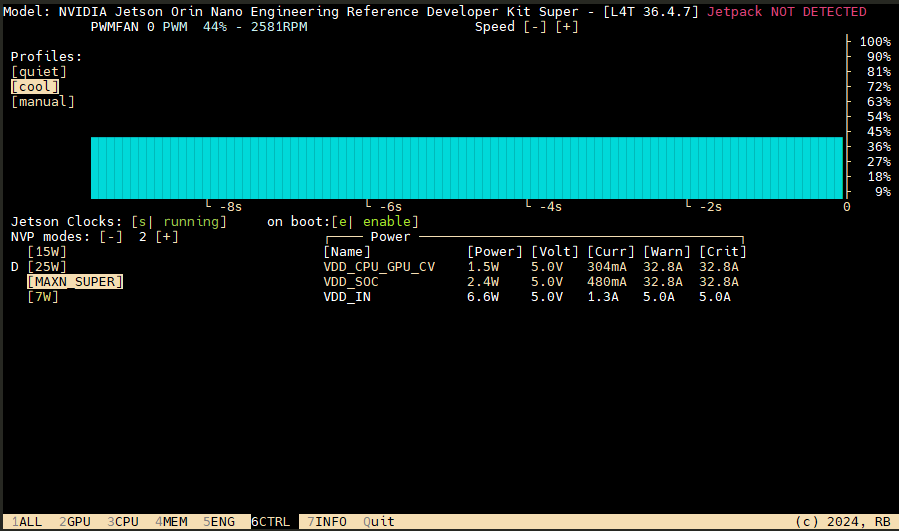
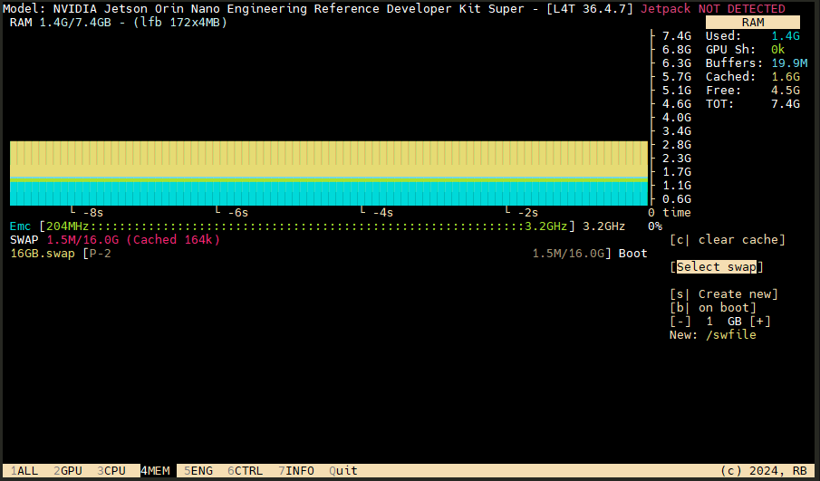
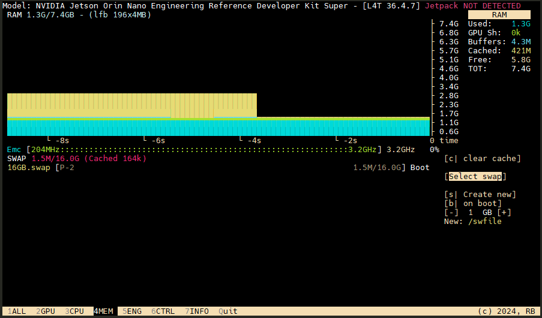
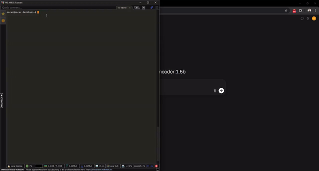
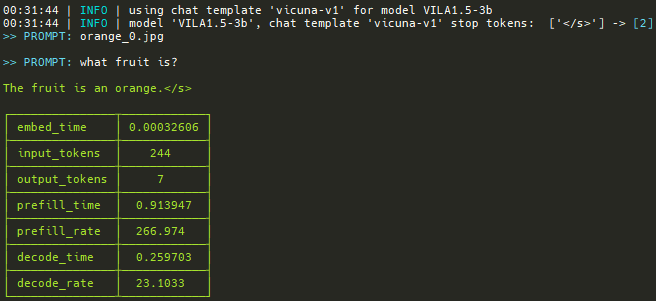

# Jetson Orin Nano AI Development

This repository contains AI/ML development projects and deployment configurations for the NVIDIA Jetson Orin Nano, including vision processing, LLM inference, and self-driving applications.


*NVIDIA Jetson Orin Nano 8GB Developer Kit with NVMe SSD and cooling setup*

## Prerequisites

- NVIDIA Jetson Orin Nano (8GB) with JetPack 6
- Docker with NVIDIA runtime support
- NVMe SSD mounted at `/ssd` (highly recommended for performance and storage)

**Setup References:**
- **Initial Setup (SD Card + NVMe SSD):** https://www.jetson-ai-lab.com/initial_setup_jon.html
- **SSD Configuration for Docker:** https://www.jetson-ai-lab.com/tips_ssd-docker.html
- **Jetson Containers Installation:** https://github.com/dusty-nv/jetson-containers/blob/master/docs/setup.md

**Configure jetson-containers alias:**

```bash
echo 'alias jetson-containers="/ssd/jetson-containers/jetson-containers"' >> ~/.bashrc
echo 'export PATH="/ssd/jetson-containers:$PATH"' >> ~/.bashrc
source ~/.bashrc
```

This allows you to run `jetson-containers` from any directory.

## Jetson Configuration

### Finding Jetson IP Address

To connect via SSH, you need to find the Jetson's IP address:

```bash
# Show all network interfaces and their IPs
ip addr show

# Or use hostname -I to show all IPs
hostname -I
```

**Common interfaces:**
- `eth0`: Ethernet connection
- `wlan0`: WiFi connection
- `l4tbr0` or `usb0`: USB network connection (when connected via USB to host computer)

**Quick reference:**
```bash
# Ethernet IP
ip addr show eth0 | grep 'inet '

# WiFi IP
ip addr show wlan0 | grep 'inet '

# USB network IP
ip addr show l4tbr0 | grep 'inet '
```

### Disable GUI to Free GPU Memory

For better GPU performance, disable the graphical interface and use SSH-only mode:

```bash
sudo systemctl set-default multi-user.target
sudo reboot
```

To re-enable the GUI later (if needed):

```bash
sudo systemctl set-default graphical.target
sudo reboot
```

### Performance Optimization

Best practices for maximizing performance on the Jetson Orin Nano:

#### Install Jetson Stats Application

Monitor system temperatures, CPU/GPU/RAM utilization, and manage performance settings:

```bash
sudo apt update
sudo pip install jetson-stats
sudo reboot
```

Run the monitoring tool:

```bash
jtop
```

#### Configure Performance Settings in jtop

**IMPORTANT:** Follow these steps in order BEFORE loading models or running inference scripts:

**1. Set Fan Profile to Cool Mode**

Press **`5`** to go to the CTRL section, then navigate to Profiles and select **[cool]**:



- **Fan Profile:** Set to **[cool]** (keeps temperature low under heavy load)
- **Jetson Clocks:** Press **`s`** to start (shows **[s] running**)
- **NVP Power Mode:** Select **MAXN SUPER** or **25W** mode

**2. Clear Memory Cache**

Press **`4`** to go to the MEM section, then press **`c`** to clear cache:



*Before: Cache uses ~1.6G of memory*



*After: Cache reduced to ~421M, freeing up memory for models*

**IMPORTANT:** Clear the cache **every time** before loading a model or running an inference script. This ensures maximum GPU memory is available for your models, preventing out-of-memory errors and improving performance.

**3. Verify Settings**

Ensure the following are active:
- ✅ Fan profile: **cool**
- ✅ Jetson Clocks: **running**
- ✅ Power Mode: **MAXN SUPER** or **25W**
- ✅ Cache: **cleared**

**Command Line Alternatives:**

```bash
# Enable MAX Power Mode
sudo nvpmodel -m 2

# Enable Jetson Clocks
sudo jetson_clocks
```

**Note:** These optimizations are **critical** when running compute-intensive workloads like YOLO object detection or LLM inference. Always clear cache before loading new models to maximize available memory.

## Setup

This repository supports multiple AI/ML workloads. Choose the setup that matches your use case:

### 1. Vision Processing (Object Detection)

Uses the Ultralytics container for YOLO-based object detection and vision tasks.

**Demo:**


*Real-time object detection running on Jetson Orin Nano*

**First time - create and run with a name:**

```bash
sudo docker run -it --name ultralytics-jetson \
  --ipc=host \
  --runtime=nvidia \
  --privileged \
  -v /ssd:/ssd \
  -w /ssd \
  -p 5000:5000 \
  -p 5001:5001 \
  ultralytics/ultralytics:latest-jetson-jetpack6
```

**Subsequent runs - just start the existing container:**

```bash
sudo docker start -ai ultralytics-jetson
```

**Install Flask for web-based applications:**

```bash
pip install flask
```

**Running Object Detection Web Interface:**

1. **Start the detection server** (inside the Docker container):

```bash
python src/detection_server.py
```

2. **Access in your browser:**
```
http://<JETSON_IP>:5000
```

Replace `<JETSON_IP>` with your Jetson's IP address (e.g., `http://192.168.1.100:5000`)

**Example applications:**
- `src/detection_server.py` - Real-time camera detection with web streaming (Flask, port 5000)
- `src/segmentation_server.py` - Instance segmentation with web interface (Flask, port 5001)
- `src/video_detector.py` - Video file processing (command-line only)

#### Instance Segmentation

For pixel-level object segmentation, use the YOLO11n segmentation model:

**Demo:**


*YOLO11n-seg providing pixel-perfect masks for detected objects*

**1. Download and validate the segmentation model:**

```python
from ultralytics import YOLO

# Load a pretrained segmentation model
model = YOLO("yolo11n-seg.pt")

# Validate the model
metrics = model.val()
print("Mean Average Precision for boxes:", metrics.box.map)
print("Mean Average Precision for masks:", metrics.seg.map)
```

**2. Export to TensorRT for GPU acceleration:**

```bash
# Export YOLO11n segmentation model to TensorRT format
yolo export model=yolo11n-seg.pt format=engine  # creates 'yolo11n-seg.engine'
```

Or using Python:

```python
from ultralytics import YOLO

# Load and export the segmentation model
model = YOLO("yolo11n-seg.pt")
model.export(format="engine")  # creates 'yolo11n-seg.engine'
```

**3. Run the segmentation server:**

```bash
python src/segmentation_server.py
```

**4. Access in your browser:**
```
http://<JETSON_IP>:5001
```

The segmentation model provides pixel-perfect masks for detected objects, useful for more precise scene understanding compared to bounding boxes alone.

### 2. LLM Inference (Local Language Models)

Run large language models locally on the Jetson Orin Nano using Ollama.

**Demo:**



*Gemma 3 running locally on Jetson Orin Nano via Ollama with Open WebUI chat interface*

**Setup with jetson-containers:**

```bash
jetson-containers run \
  -v /ssd/ollama:/ollama \
  -e OLLAMA_MODELS=/ollama \
  $(autotag ollama)
```

**Download LLM Models:**

Inside the container or on the host (if using native Ollama), pull models:

```bash
ollama pull gemma3:4b
```

Browse available models at: **https://ollama.com/search**

**Understanding Model Names:**

Model names follow the format: `model_name:parameters-variant-quantization`

Example: `gemma3:4b-it-q4_K_M`
- **gemma3** - Model name/family
- **4b** - Number of parameters (4 billion)
- **it** - Instruction-tuned variant
- **q4_K_M** - Quantization method (4-bit, K-quant, Medium precision)

**Common parameter sizes for Jetson Orin Nano 8GB:**
- **1b-3b** - Very fast, good for simple tasks
- **4b-7b** - Balanced performance and quality (recommended)
- **8b-13b** - Slower but higher quality (may require aggressive quantization)

**Quantization types (lower bits = faster but less accurate):**
- **Q4_K_M** - 4-bit, medium quality (good balance)
- **Q4_K_S** - 4-bit, small/fast
- **Q5_K_M** - 5-bit, better quality
- **Q8_0** - 8-bit, high quality but larger

**Recommended models for Jetson Orin Nano:**
```bash
ollama pull gemma3:4b           # Google's efficient 4B model
ollama pull phi3:3.8b           # Microsoft's compact model
ollama pull llama3.2:3b         # Meta's lightweight Llama
ollama pull qwen2.5:3b          # Alibaba's multilingual model
```

**Run a model:**

```bash
ollama run gemma3:4b
```

**Access Ollama API:**

```bash
curl http://localhost:11434/api/generate -d '{
  "model": "gemma3:4b",
  "prompt": "Why is the sky blue?"
}'
```

#### Optional: Open WebUI (Chat Interface)

Provides a ChatGPT-like interface for Ollama:

```bash
sudo docker run -d --network=host \
  -v /ssd/open-webui:/app/backend/data \
  -e OLLAMA_BASE_URL=http://127.0.0.1:11434 \
  --name open-webui \
  --restart always \
  ghcr.io/open-webui/open-webui:main
```

Access at `http://<JETSON_IP>:8080`

**Storage Requirements:**
- Ollama container: ~7GB
- Model sizes: 2GB-8GB per model
- Recommended: NVMe SSD with 64GB+ free space

### 3. Vision Language Models (VLMs)

Vision Language Models combine visual understanding with language capabilities, enabling the model to analyze images and answer questions about them.

**1. Start the nano_llm container:**

```bash
jetson-containers run $(autotag nano_llm)
```

**2. Run VILA 1.5-3B inside the container:**

```bash
python3 -m nano_llm.chat --api mlc \
  --model Efficient-Large-Model/VILA1.5-3b \
  --max-context-len 256 \
  --max-new-tokens 32
```

**Model Details:**
- **VILA 1.5-3B** - Efficient vision-language model optimized for edge devices
- **Parameters:** 3 billion (good balance for Jetson Orin Nano 8GB)
- **Capabilities:** Image understanding, visual question answering, image captioning

**Usage:**
The model accepts both text prompts and images, allowing you to ask questions about visual content. Perfect for applications requiring visual understanding combined with natural language processing.

**Example - Fruit Detection:**

Inside the container, download a test image and ask the VLM about it:

```bash
# Download test image inside the container
wget https://raw.githubusercontent.com/dusty-nv/jetson-inference/master/data/images/orange_0.jpg

# Run VILA with the image and ask a question
python3 -m nano_llm.chat --api mlc \
  --model Efficient-Large-Model/VILA1.5-3b \
  --max-context-len 256 \
  --max-new-tokens 32
```

**Input Image (downloaded via wget inside container):**


When prompted, provide the image path and ask questions:

```
>> PROMPT: orange_0.jpg
>> PROMPT: what fruit is?
```

**Output:**



The model correctly identifies the fruit as an orange, demonstrating its visual understanding capabilities. Performance metrics show efficient inference on the Jetson Orin Nano:
- **Prefill rate:** 266.97 tokens/sec
- **Decode rate:** 23.10 tokens/sec

**Live Camera VLM - Real-time Video Question Answering:**

For real-time visual question answering with a live camera feed:

```bash
jetson-containers run $(autotag nano_llm) \
  python3 -m nano_llm.agents.video_query --api=mlc \
  --model Efficient-Large-Model/VILA1.5-3b \
  --max-context-len 256 \
  --max-new-tokens 32 \
  --video-input /dev/video0 \
  --video-output webrtc://@:8554/output
```

**Demo:**


*Real-time visual question answering with VILA 1.5-3B processing live camera feed*

This enables interactive visual Q&A with your camera, streaming the annotated results via WebRTC on port 8554.

**Alternative VLM - Obsidian 3B:**

```bash
jetson-containers run $(autotag nano_llm) \
  python3 -m nano_llm.chat --api=mlc \
  --model NousResearch/Obsidian-3B-V0.5 \
  --max-context-len 256 \
  --max-new-tokens 32
```

**Storage Requirements:**
- nano_llm container: ~8GB
- VILA 1.5-3B model: ~6GB
- Obsidian 3B model: ~6GB
- Recommended: NVMe SSD with 64GB+ free space

### 4. Self-Driving Applications

Development environment for autonomous vehicle algorithms using the vision processing stack.

**Demo:**


*YOLO11n detecting vehicles, pedestrians, traffic lights, and stop signs on street footage*

#### Model Setup and Optimization

This project uses YOLO11n optimized for the Jetson Orin Nano's GPU through TensorRT quantization:

**1. Download the pretrained model:**

```python
from ultralytics import YOLO

# Download YOLO11n PyTorch model
model = YOLO("yolo11n.pt")
```

**2. Export to TensorRT for GPU acceleration:**

```python
# Export the model to TensorRT engine format
model.export(format="engine")  # creates 'yolo11n.engine'

# Load the optimized TensorRT model
trt_model = YOLO("yolo11n.engine")
```

The TensorRT engine (`yolo11n.engine`) provides significant performance improvements on Jetson hardware compared to the original PyTorch model.

**Model files in this repo:**
- `models/yolo11n.pt` - Original PyTorch model (5.6 MB)
- `models/yolo11n.onnx` - ONNX intermediate format (10.7 MB)
- `models/yolo11n.engine` - TensorRT optimized for Jetson (12.5 MB)

#### Processing Videos with Object Detection

Use `video_detector.py` to process video files with self-driving relevant object detection:

```bash
# Process a video file
python src/video_detector.py <input_video.mp4> <output_video.mp4>

# Example
python src/video_detector.py street_footage.mp4 detected_street.mp4
```

**Detected object classes:**
- Vehicles: car, bus, truck, motorcycle, bicycle
- Pedestrians: person
- Traffic infrastructure: traffic light, stop sign

The detector filters YOLO's 80 classes to focus only on objects relevant for self-driving scenarios.

## License

This project is licensed under the MIT License - see the [LICENSE](LICENSE) file for details.
