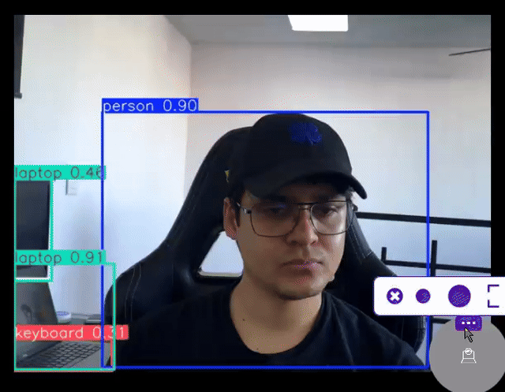
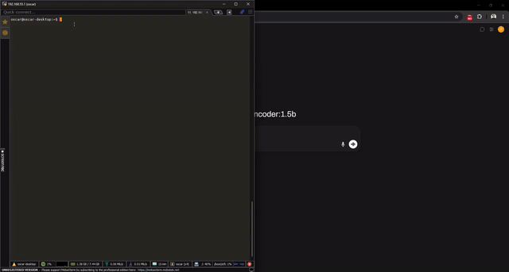
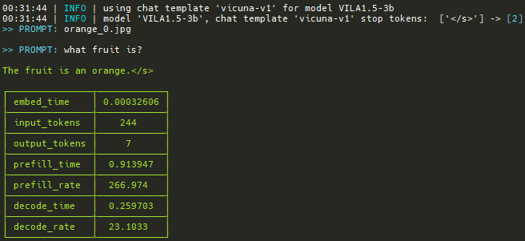
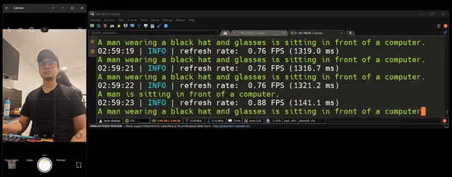
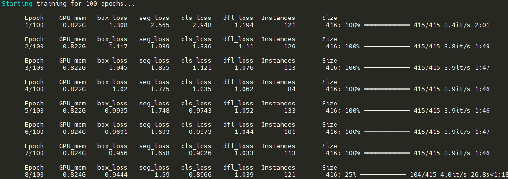
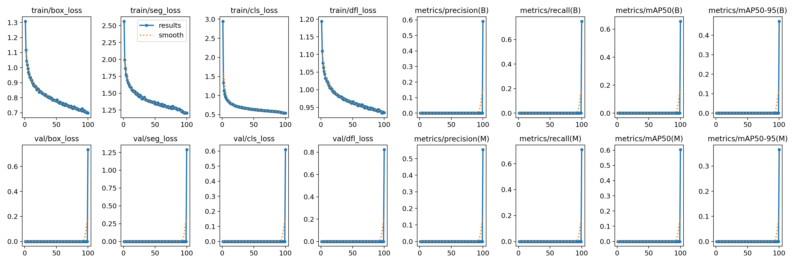
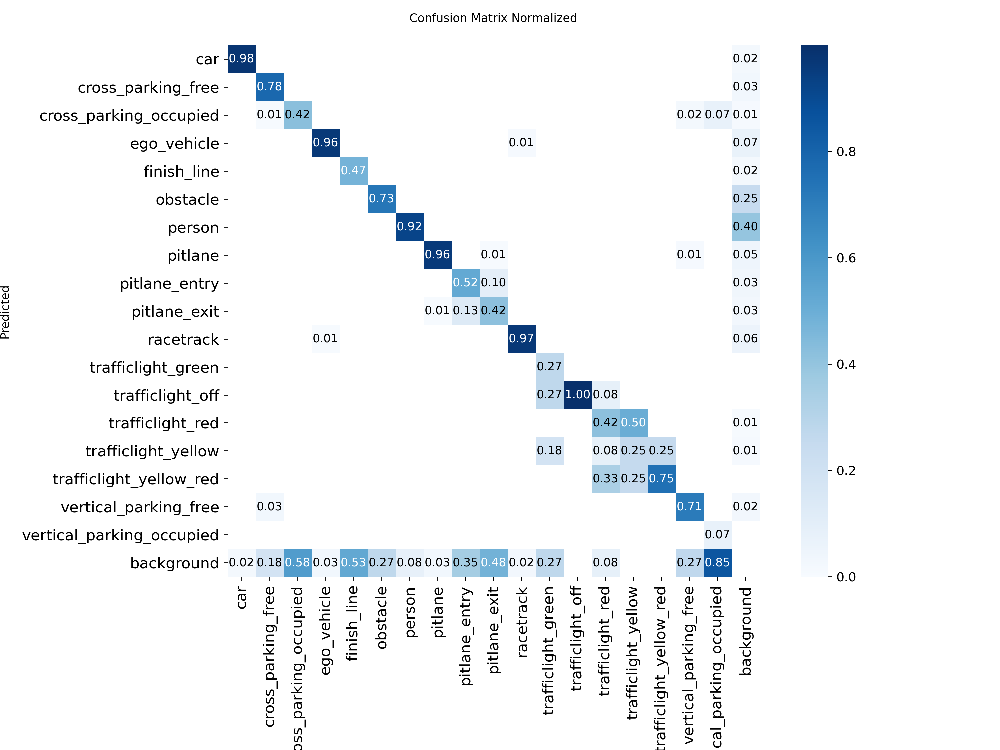
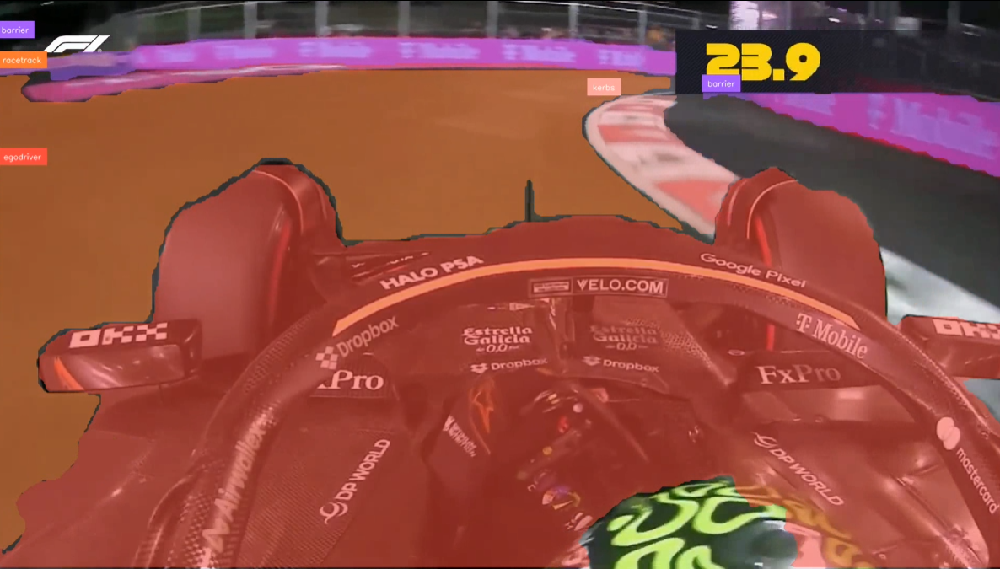
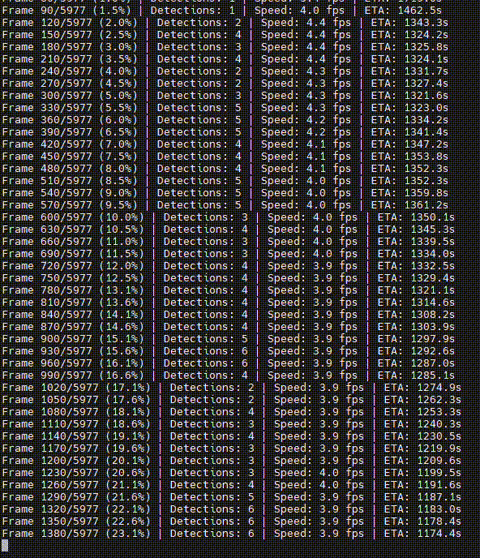
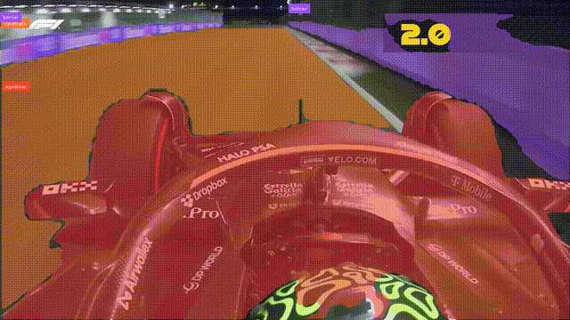

<div align="center">

# Jetson Orin Nano AI Development

This repository contains AI/ML development projects and deployment configurations for the NVIDIA Jetson Orin Nano, including vision processing, LLM inference, self-driving applications, and Formula 1 computer vision.

<p>
  <a href="#prerequisites"></a>
  &nbsp;
  <a href="#jetson-configuration"></a>
  &nbsp;
  <a href="#1-vision-processing-object-detection"></a>
  &nbsp;
  <a href="#2-llm-inference-local-language-models"></a>
  &nbsp;
  <a href="#3-vision-language-models-vlms"></a>
  &nbsp;
  <a href="#4-self-driving-applications"></a>
  &nbsp;
  <a href="#5-formula-1"></a>
  &nbsp;
  <a href="docs/troubleshooting/README.md"></a>
  &nbsp;
  <a href="agent/AGENTS.md"></a>
</p>


<sub>NVIDIA Jetson Orin Nano 8GB Developer Kit with NVMe SSD and cooling setup</sub>

</div>

---

## Contents

This repository supports multiple AI/ML workloads. Choose the setup that matches your use case:

- [Prerequisites](#prerequisites)
- [Jetson configuration](#jetson-configuration) — [Connecting to the Jetson](#connecting-to-jetson) · [Headless mode](#disable-gui-to-free-gpu-memory) · [Performance optimization](#performance-optimization)
- [1. Vision processing (object detection)](#1-vision-processing-object-detection) — [How the web streaming works](#how-the-web-streaming-works-one-loop-many-viewers) · [Instance segmentation](#instance-segmentation)
- [2. LLM inference (local language models)](#2-llm-inference-local-language-models) — [Open WebUI](#optional-open-webui-chat-interface)
- [3. Vision Language Models (VLMs)](#3-vision-language-models-vlms) — [nano_llm / VILA (everything on the Jetson)](#nano_llm--vila-everything-on-the-jetson) · [Cosmos-Reason2-2B + vLLM (physical reasoning from the PC)](#cosmos-reason2-2b-with-vllm-physical-reasoning-driven-from-the-pc)
- [4. Self-driving applications](#4-self-driving-applications) — [Processing videos with object detection](#processing-videos-with-object-detection)
- [5. Formula 1](#5-formula-1) — [Training custom YOLO models](#training-custom-yolo-models-for-f1-racing) · [F1 racetrack segmentation](#f1-racetrack-segmentation) · [Onboard segmentation with Roboflow](#f1-onboard-instance-segmentation-with-roboflow)
- [Troubleshooting runbooks](docs/troubleshooting/README.md)
- [INT8 TensorRT engine benchmarks](docs/performance/int8-tensorrt-engines.md)
- [NVDEC hardware decode notes](docs/performance/nvdec-decode-notes.md)
- [Cosmos-Reason2-2B + vLLM serving runbook](docs/cosmos-reason2-vllm.md)
- [AI agent guide](agent/AGENTS.md) — [Setup guide (new Jetson)](agent/SETUP.md) · [Field notes & lessons](agent/FIELD_NOTES.md)
- [License](#license)

---

## Prerequisites

- NVIDIA Jetson Orin Nano (8GB) with JetPack 6
- Docker with NVIDIA runtime support
- NVMe SSD mounted at `/ssd` (highly recommended for performance and storage)

**Setup References:**

- **Initial Setup (SD Card + NVMe SSD):** https://www.jetson-ai-lab.com/initial_setup_jon.html
- **SSD Configuration for Docker:** https://www.jetson-ai-lab.com/tips_ssd-docker.html
- **Jetson Containers Installation:** https://github.com/dusty-nv/jetson-containers/blob/master/docs/setup.md
- **RAM Optimization:** https://www.jetson-ai-lab.com/tips_ram-optimization.html

**Configure jetson-containers alias:**

```bash
echo 'alias jetson-containers="/ssd/jetson-containers/jetson-containers"' >> ~/.bashrc
echo 'export PATH="/ssd/jetson-containers:$PATH"' >> ~/.bashrc
source ~/.bashrc
```

This allows you to run `jetson-containers` from any directory.

---

## Jetson configuration

### Connecting to Jetson

You can work with the Jetson using different connection methods:

1. **Direct connection**: Keyboard + mouse + monitor connected to the Jetson
2. **SSH (remote connection)**: Access from your computer via network (headless mode)
3. **Hybrid**: Use both methods simultaneously

**Finding Your Jetson's IP Address:**

To connect via SSH, you first need to find the Jetson's IP address:

```bash
# Show all network interfaces with their IPs (brief format)
ip -br addr show
```

**Example output:**

```
lo               UNKNOWN        127.0.0.1/8 ::1/128
can0             DOWN
wlP1p1s0         UP             192.168.1.100/24
enP8p1s0         DOWN
l4tbr0           DOWN
usb0             DOWN
usb1             DOWN
docker0          DOWN           172.17.0.1/16
```

Look for interfaces with status **UP** to find your active connection IP address.

**SSH Connection Instructions:**

**Windows users** - Use an SSH client like:

- **MobaXterm** (recommended - includes X11 forwarding and file transfer)
- PuTTY
- Windows Terminal with built-in SSH

**Linux/Mac users** - Use the built-in terminal SSH client:

```bash
ssh <username>@<JETSON_IP>

# Example
ssh jetson@192.168.1.100
```

**Benefits of headless (SSH-only) operation:**

- Frees up GPU memory by disabling the graphical interface
- Access Jetson from any device on your network (laptop, desktop, tablet)
- More efficient for development workflows
- Run multiple SSH sessions simultaneously

### Disable GUI to free GPU memory

For maximum GPU performance, disable the graphical interface and work in SSH-only mode (headless operation - see SSH connection instructions above):

```bash
sudo systemctl set-default multi-user.target
sudo reboot
```

To re-enable the GUI later (if needed):

```bash
sudo systemctl set-default graphical.target
sudo reboot
```

### Performance optimization

Best practices for maximizing performance on the Jetson Orin Nano.

#### Install Jetson Stats application

Monitor system temperatures, CPU/GPU/RAM utilization:

```bash
sudo apt update
sudo pip install jetson-stats
sudo reboot
```

Run the monitoring tool:

```bash
jtop
```

#### Clocks and fan — locked at boot, leave jtop's fan controls alone

Max performance (CPU 1.7 GHz ×6, GPU 1.02 GHz, fan at full PWM, MAXN_SUPER)
is applied at every boot by the custom `jetson_clocks.service` oneshot — see
the [clocks/fan runbook](docs/troubleshooting/lock-clocks-fan-maxn-super.md)
for the full design and verification steps.

⚠️ **Do not set a fan profile from jtop**: its saved profiles re-enable
`nvfancontrol`, which fights the boot-time lock. jtop's fan controls are
deliberately disarmed on this machine (`fan` removed from
`/usr/local/jtop/config.json`) — use jtop as a *monitor* only.

Verify the lock is active after boot: `sudo jetson_clocks --show` should list
max clocks and fan PWM 255; sustained loads (e.g. a 10-minute `trtexec` run)
should show zero clock dips and GPU ≤ ~60 °C.

#### Memory cache: clear it for builds and big loads — not for every run

On unified memory the kernel reclaims file cache automatically when
allocations need it — clearing cache before ordinary inference buys nothing.
The one real consumer is **TensorRT tactic autotuning**: it checks free
memory per tactic and skips tactics that don't fit (`Tactic … Available:
0MB` in the build log), so a multi-GB page cache can fail an engine build
with no actual OOM.

Clear it event-time, right before the operations that gate on free memory:

```bash
sync && sudo sysctl vm.drop_caches=3
```

- Before **TensorRT engine builds / engine deserialization** (and after big
  file churn that immediately precedes one).
- Before **multi-GB model loads** (LLM containers: nano_llm, ollama).

Skip it before YOLO engine loads (5–9 MB) or server restarts — the dropped
cache is exactly the data they'd reuse. Never daemonize a cache cleaner.

The structural fix is a persistent free-memory floor, which makes TensorRT's
headroom checks pass without dropping anything:

```bash
echo vm.min_free_kbytes = 131072 | sudo tee /etc/sysctl.d/99-jetson-free-floor.conf
sudo sysctl -w vm.min_free_kbytes=131072
```

Keep it at 128–256 MB on this 8 GB board — a floor that is too high reserves
memory nothing can use and can itself cause OOM kills.

#### Service memory policy — one heavy service at a time ("inference mode")

Everything shares one 8 GB CPU/GPU heap, so the limiting resource is not disk
or CPU — it is resident memory of concurrently running services. Two
torch/TensorRT stacks at once ≈ swap thrashing and inference latency collapse.

| Service | Image | ~Resident | Runs alongside YOLO inference? |
|---|---|---|---|
| YOLO detect/seg servers | `ultralytics/ultralytics:latest-jetson-jetpack6` | 2–3 GB | — (this *is* the baseline) |
| Agent ops (cache drop, sysctl) | `alpine:latest` (8 MB) | negligible | ✅ always fine |
| Roboflow inference server (F1 demo, §5) | `roboflow/roboflow-inference-server-jetson-6.0.0` | 2–4 GB | ⚠️ only for that demo, not with both YOLO servers |
| LLM / VLM serving (`nano_llm`, ollama + WebUI, §2–3) | `dustynv/nano_llm`, ollama images | 6–8 GB with model loaded | ❌ never — run exclusively |
| Cosmos-Reason2 vLLM serving (§3) | `ghcr.io/nvidia-ai-iot/vllm:0.14.0-r36.4-tegra-aarch64-cu126-22.04` | 6–8 GB with model loaded | ❌ never — run exclusively ([runbook](docs/cosmos-reason2-vllm.md)) |

Pruned 2026-09-01 (issue #12): the idle Roboflow (16.8 GB) and `nano_llm`
(30.6 GB) images were removed — re-pull them with the run commands in §5 / §3
when needed (for `nano_llm`, pick a tag matching the current L4T release).

**Entering inference mode** (before demos, benchmarks, engine builds):

```bash
docker ps                 # anything running that isn't the inference server?
docker stop <name>        # stop it — see the table above
free -m                   # ~6 GB available before loading models
```

Memory layout in place on this machine (build your own from the
[RAM optimization guide](https://www.jetson-ai-lab.com/tips_ram-optimization.html)):
headless multi-user target (no GUI), 6 × zram (~3.8 GB) plus a 16 GB swapfile
on `/ssd`, and the 128 MB free-memory floor applied at
`/etc/sysctl.d/99-jetson-free-floor.conf` (2026-09-01 — verified to hold
under 4 GB of allocation pressure). Swap is a safety net, not extra speed:
if `free -m` shows heavy swap-in during inference, a second heavy service is
running and should be stopped.

---

## 1. Vision processing (object detection)

Uses the Ultralytics container for YOLO-based object detection and vision tasks.

**Demo:**



*Real-time object detection running on Jetson Orin Nano*

**First time - create and run with a name:**

```bash
sudo docker run -it --name ultralytics-jetson \
  --ipc=host \
  --runtime=nvidia \
  --privileged \
  -v /ssd:/ssd \
  -w /ssd \
  -p 5000:5000 \
  -p 5001:5001 \
  ultralytics/ultralytics:latest-jetson-jetpack6
```

**Subsequent runs - just start the existing container:**

```bash
sudo docker start -ai ultralytics-jetson
```

**Install Flask for web-based applications:**

```bash
pip install flask
```

**Running Object Detection Web Interface:**

1. **Start the detection server** (inside the Docker container):

```bash
python src/detection_server.py
```

2. **Access in your browser:**

```
http://<JETSON_IP>:5000
```

Replace `<JETSON_IP>` with your Jetson's IP address (e.g., `http://192.168.1.100:5000`)

**Which model is being served?** The detection server loads the INT8 engine
(`/ssd/yolo11n-int8.engine`), falling back to FP16 if it's missing. INT8
stores weights and activations as 8-bit integers instead of 16-bit floats:
about 1.5 mAP points cheaper in accuracy, ~28% more throughput (see the
[INT8 benchmarks](docs/performance/int8-tensorrt-engines.md)). The
segmentation server stays on FP16 (`yolo11n-seg.engine`) — TensorRT 10.3 on
Orin cannot compile that model's segmentation layer in INT8 yet.

### How the web streaming works: one loop, many viewers

The servers stream **MJPEG** — an endless sequence of annotated JPEG frames
over plain HTTP; the browser renders each frame as it arrives.

Every viewer shares **one background loop** (issue #9): a single thread
captures → runs YOLO → encodes → publishes the newest JPEG to a shared
buffer, and every browser on `/video_feed` reads from that buffer — like a
TV broadcast, where extra viewers add no cameras or announcers. This avoids
two Jetson hazards (V4L2 cameras allow a single reader; a TensorRT engine is
safest called from one thread) and keeps inference cost flat: ~27 fps
(detection) / ~16.5 fps (segmentation) at 1080p whether 1 or 3 viewers
watch, versus ~2.6× the GPU work before the restructure.

```bash
# Health check (detection :5000, segmentation :5001):
http://<JETSON_IP>:5000/stats   # {"server_fps": 27.1, "viewers": 2, "source": "0", ...}

# No camera? Any video file works as the source and loops forever:
SOURCE=/ssd/videos/street_footage.mp4 python src/detection_server.py
# SOURCE=1 selects a second camera (default: 0)
```

If the capture loop stalls (camera unplugged, file removed), each viewer's
stream closes after 10 s instead of hanging forever.

**Example applications:**

- `src/detection_server.py` - Real-time camera detection with web streaming (Flask, port 5000, INT8 engine with FP16 fallback)
- `src/segmentation_server.py` - Instance segmentation with web interface (Flask, port 5001)
- `src/video_detector.py` - Video file processing with NVDEC/software decode selection (command-line only)

### Instance segmentation

For pixel-level object segmentation, use the YOLO11n segmentation model:

**Demo:**


*YOLO11n-seg providing pixel-perfect masks for detected objects*

**1. Download and validate the segmentation model:**

```python
from ultralytics import YOLO

# Load a pretrained segmentation model
model = YOLO("yolo11n-seg.pt")

# Validate the model
metrics = model.val()
print("Mean Average Precision for boxes:", metrics.box.map)
print("Mean Average Precision for masks:", metrics.seg.map)
```

**2. Export to TensorRT for GPU acceleration:**

```bash
# Export YOLO11n segmentation model to TensorRT format
yolo export model=yolo11n-seg.pt format=engine  # creates 'yolo11n-seg.engine'
```

Or using Python:

```python
from ultralytics import YOLO

# Load and export the segmentation model
model = YOLO("yolo11n-seg.pt")
model.export(format="engine")  # creates 'yolo11n-seg.engine'
```

**3. Run the segmentation server:**

```bash
python src/segmentation_server.py
```

**4. Access in your browser:**

```
http://<JETSON_IP>:5001
```

The segmentation model provides pixel-perfect masks for detected objects, useful for more precise scene understanding compared to bounding boxes alone.

---

## 2. LLM inference (local language models)

Run large language models locally on the Jetson Orin Nano using Ollama.

**Demo:**



*Gemma 3 running locally on Jetson Orin Nano via Ollama with Open WebUI chat interface*

**Setup with jetson-containers:**

```bash
jetson-containers run \
  -v /ssd/ollama:/ollama \
  -e OLLAMA_MODELS=/ollama \
  $(autotag ollama)
```

**Download LLM Models:**

Inside the container or on the host (if using native Ollama), pull models:

```bash
ollama pull gemma3:4b
```

Browse available models at: **https://ollama.com/search**

**Understanding Model Names:**

Model names follow the format: `model_name:parameters-variant-quantization`

Example: `gemma3:4b-it-q4_K_M`

- **gemma3** - Model name/family
- **4b** - Number of parameters (4 billion)
- **it** - Instruction-tuned variant
- **q4_K_M** - Quantization method (4-bit, K-quant, Medium precision)

**Common parameter sizes for Jetson Orin Nano 8GB:**

- **1b-3b** - Very fast, good for simple tasks
- **4b-7b** - Balanced performance and quality (recommended)
- **8b-13b** - Slower but higher quality (may require aggressive quantization)

**Quantization types (lower bits = faster but less accurate):**

- **Q4_K_M** - 4-bit, medium quality (good balance)
- **Q4_K_S** - 4-bit, small/fast
- **Q5_K_M** - 5-bit, better quality
- **Q8_0** - 8-bit, high quality but larger

**Recommended models for Jetson Orin Nano:**

```bash
ollama pull gemma3:4b           # Google's efficient 4B model
ollama pull phi3:3.8b           # Microsoft's compact model
ollama pull llama3.2:3b         # Meta's lightweight Llama
ollama pull qwen2.5:3b          # Alibaba's multilingual model
```

**Run a model:**

```bash
ollama run gemma3:4b
```

**Access Ollama API:**

```bash
curl http://localhost:11434/api/generate -d '{
  "model": "gemma3:4b",
  "prompt": "Why is the sky blue?"
}'
```

### Optional: Open WebUI (chat interface)

Provides a ChatGPT-like interface for Ollama:

```bash
sudo docker run -d --network=host \
  -v /ssd/open-webui:/app/backend/data \
  -e OLLAMA_BASE_URL=http://127.0.0.1:11434 \
  --name open-webui \
  --restart always \
  ghcr.io/open-webui/open-webui:main
```

Access at `http://<JETSON_IP>:8080`

**Storage Requirements:**

- Ollama container: ~7GB
- Model sizes: 2GB-8GB per model
- Recommended: NVMe SSD with 64GB+ free space

---

## 3. Vision Language Models (VLMs)

Vision Language Models combine visual understanding with language capabilities, enabling the model to analyze images and answer questions about them. This repo has two serving paths — pick by workload:

| | **nano_llm / VILA** | **Cosmos-Reason2-2B + vLLM** |
|---|---|---|
| What runs where | Everything on the Jetson | Jetson serves the API; UI + webcam stay on the PC |
| Camera → output | `/dev/video0` on the Jetson → WebRTC on `:8554` | PC webcam → Live VLM WebUI `:8090` → vLLM `:8010` |
| API | nano_llm chat / `video_query` | OpenAI-compatible `/v1` on `:8010` |
| Trained for | General image chat, captioning, visual Q&A | **Physical reasoning**: hazards, collisions, spatial state |
| Weight | The lighter path (one MLC container) | Heavier (vLLM container + FP8 weights), reason-first answers |

Use **VILA** for interactive "what am I looking at" chat against a Jetson-attached camera. Use **Cosmos-Reason2** when the questions are physical — *is that load stable, will the robot clip the table edge* — or when you want an OpenAI-compatible endpoint other tools can target. Both paths are memory-exclusive on this 8 GB board: one VLM at a time, nothing else heavy alongside.

### nano_llm / VILA: everything on the Jetson

**1. Start the nano_llm container:**

```bash
jetson-containers run $(autotag nano_llm)
```

**2. Run VILA 1.5-3B inside the container:**

```bash
python3 -m nano_llm.chat --api mlc \
  --model Efficient-Large-Model/VILA1.5-3b \
  --max-context-len 256 \
  --max-new-tokens 32
```

**Model Details:**

- **VILA 1.5-3B** - Efficient vision-language model optimized for edge devices
- **Parameters:** 3 billion (good balance for Jetson Orin Nano 8GB)
- **Capabilities:** Image understanding, visual question answering, image captioning

**Usage:** the model accepts both text prompts and images, so you can ask questions about visual content.

**Example - Fruit Detection:**

Inside the container, download a test image, start the same chat session as in step 2, and ask the VLM about it:

```bash
wget https://raw.githubusercontent.com/dusty-nv/jetson-inference/master/data/images/orange_0.jpg
```

**Input Image (downloaded via wget inside container):**


When prompted, provide the image path and ask questions:

```
>> PROMPT: orange_0.jpg
>> PROMPT: what fruit is?
```

**Output:**



The model correctly identifies the fruit as an orange, demonstrating its visual understanding capabilities. Performance metrics show efficient inference on the Jetson Orin Nano:

- **Prefill rate:** 266.97 tokens/sec
- **Decode rate:** 23.10 tokens/sec

**Live Camera VLM - Real-time Video Question Answering:**

For real-time visual question answering with a live camera feed:

```bash
jetson-containers run $(autotag nano_llm) \
  python3 -m nano_llm.agents.video_query --api=mlc \
  --model Efficient-Large-Model/VILA1.5-3b \
  --max-context-len 256 \
  --max-new-tokens 32 \
  --video-input /dev/video0 \
  --video-output webrtc://@:8554/output
```

**Demo:**



*Real-time visual question answering with VILA 1.5-3B processing live camera feed*

This enables interactive visual Q&A with your camera, streaming the annotated results via WebRTC on port 8554.

**Alternative VLM - Obsidian 3B:**

```bash
jetson-containers run $(autotag nano_llm) \
  python3 -m nano_llm.chat --api=mlc \
  --model NousResearch/Obsidian-3B-V0.5 \
  --max-context-len 256 \
  --max-new-tokens 32
```

### Cosmos-Reason2-2B with vLLM: physical reasoning, driven from the PC

NVIDIA's Cosmos-Reason2-2B (FP8 checkpoint from NGC, not HF) served by vLLM as an OpenAI-compatible endpoint on `:8010`, driven from the PC by [Live VLM WebUI](https://github.com/NVIDIA-AI-IOT/live-vlm-webui) with the PC's webcam. The model is post-trained for physical reasoning — hazards, collisions, spatial state — which VILA is not.

**Topology** (the LAN link is permanent: webcam and UI live on the PC, and every process kept off the Jetson is memory the model gets):

```
PC webcam → Live VLM WebUI (PC, https://localhost:8090)
              └→ OpenAI API → Jetson vLLM (http://<jetson-ip>:8010/v1)
                               └→ /ssd/models FP8 weights (~5 GB)
```

**Launch** — the full agent-executable deployment (NGC download to `/ssd/models`, pinned vLLM 0.14.0 container, GPU-exclusivity gates, verification, troubleshooting) is the [Cosmos-Reason2 + vLLM runbook](docs/cosmos-reason2-vllm.md). Day-to-day serving is one command once its env file exists:

```bash
# HOST: jetson
~/launch_vllm.sh        # exclusivity gate → serve → readiness poll
```

**Live VLM WebUI tuning on 8 GB** — set these *before* clicking Start (full flow in the runbook §5):

| Setting | Value | Why |
|---|---|---|
| Max Tokens | 100–150 | image tokens consume ~500–600 of the 1024-token context window |
| Frame Interval | 60+ | one request at a time; set it from the runbook's gate-3 latency measurement |
| Prompts | structured physical-reasoning questions | e.g. "list objects at risk of falling and any collision hazards" — not open-ended captioning |

**Storage Requirements (§3, both paths):**

- VILA path: nano_llm container ~8GB · VILA 1.5-3B model ~6GB · Obsidian 3B model ~6GB
- Cosmos path: vLLM container image ~8GB · FP8 weights ~5GB — both land on `/ssd` (`/ssd/models` per the storage convention)
- Recommended: NVMe SSD with 64GB+ free space

---

## 4. Self-driving applications

Development environment for autonomous vehicle algorithms using the vision processing stack.

**Demo:**


*YOLO11n detecting vehicles, pedestrians, traffic lights, and stop signs on street footage*

### Model setup and optimization

This project uses YOLO11n optimized for the Jetson Orin Nano's GPU through TensorRT quantization:

**1. Download the pretrained model:**

```python
from ultralytics import YOLO

# Download YOLO11n PyTorch model
model = YOLO("yolo11n.pt")
```

**2. Export to TensorRT for GPU acceleration:**

```python
# Export the model to TensorRT engine format
model.export(format="engine")  # creates 'yolo11n.engine'

# Load the optimized TensorRT model
trt_model = YOLO("yolo11n.engine")
```

The TensorRT engine (`yolo11n.engine`) provides significant performance improvements on Jetson hardware compared to the original PyTorch model.

**Model files in this repo:**

- `models/yolo11n.pt` - Original PyTorch model (5.6 MB)
- `models/yolo11n.onnx` - ONNX intermediate format (10.7 MB)
- `models/yolo11n.engine` - TensorRT FP16, built on-device (JetPack 6.2.2 / TRT 10.3) — 8.6 MB
- `models/yolo11n-int8.engine` - INT8 variant, 5.6 MB, +27.6% throughput (see [INT8 benchmarks](docs/performance/int8-tensorrt-engines.md))

⚠️ **Portability:** serialized TensorRT engines load only on the TensorRT
version and GPU architecture that built them. On any other machine, rebuild on
the device from the committed `.pt` / `.onnx` sources:

```bash
yolo export model=models/yolo11n.pt format=engine device=0
```

The same applies to `models/yolo11n-seg.engine` and `models/racetrack_model.engine`.
Build with `yolo export` (not bare `trtexec --saveEngine`) — ultralytics
engines need the metadata header `yolo export` writes, without it task
inference fails.

### Processing videos with object detection

Use `video_detector.py` to process video files with self-driving relevant object detection:

```bash
# Process a video file (max_frames is optional — stop early for quick previews)
python src/video_detector.py <input_video.mp4> <output_video.mp4> [max_frames]

# Example — full video
python src/video_detector.py street_footage.mp4 detected_street.mp4

# Example — first 300 frames only (fast iteration while tuning)
python src/video_detector.py street_footage.mp4 preview.mp4 300
```

The script loads the INT8 engine by default, prints the video's codec and
dimensions up front, and reports end-to-end fps when done.

**Decode path (a Jetson lesson):** the script prefers NVDEC hardware decode,
but only when OpenCV supports in-process GStreamer — and the pip OpenCV in
the ultralytics container doesn't. There it falls back to software decode,
which is *faster* on this stack: 1080p50 software decode runs at ~180 fps
(~0.2 CPU cores), while piping frames from an external GStreamer process
costs more than the decode it offloads. A hardware accelerator only helps
when the data path to it is cheap. Force software with `JETSON_NVDEC=0`;
there is no hardware encoder (NVENC), so the output writer stays on the CPU.
Full data: [NVDEC hardware decode notes](docs/performance/nvdec-decode-notes.md).

**Detected object classes:**

- Vehicles: car, bus, truck, motorcycle, bicycle
- Pedestrians: person
- Traffic infrastructure: traffic light, stop sign

The detector filters YOLO's 80 classes to focus only on objects relevant for self-driving scenarios.

---

## 5. Formula 1

Computer vision applications for Formula 1 racing, including track segmentation, barrier detection, and onboard footage analysis.

### Training custom YOLO models for F1 racing

This section demonstrates how to train YOLO11n-seg on custom racetrack datasets for autonomous racing applications.

**Dataset Preparation:**

The training dataset was sourced from [Roboflow&#39;s Autonomous Driving Challenge - Racetrack dataset](https://universe.roboflow.com/autonomous-driving-challenge/racetrack). The dataset was imported into a Roboflow project workspace, which allows for easy annotation management, augmentation, and export. From the Roboflow project, the dataset was exported in **YOLOv11 format**, which is directly compatible with Ultralytics YOLO training.

**Training Script:**

```python
from ultralytics import YOLO

model = YOLO('yolo11n-seg.pt')

results = model.train(
    data='/ssd/Racetrack.v1i.yolov11/data.yaml',
    epochs=100,
    imgsz=416,
    batch=8,        # Increased from 2
    workers=6,
    device=0,
    cache='ram',
    val=False,
    amp=True
)
```

Trained models are saved to `/ultralytics/runs/segment/train7/weights/best.pt`

**Handling CUDA Out-of-Memory Errors:**

Training on the Jetson Orin Nano's limited GPU memory (8GB shared with system) can trigger CUDA out-of-memory errors. If this occurs, adjust these parameters to reduce memory usage:

- **`batch`** - Reduce batch size (e.g., from 8 to 4 or 2). Smaller batches use less GPU memory but may slow training.
- **`imgsz`** - Decrease image size (e.g., from 416 to 320 or 256). Smaller images require less memory.
- **`cache`** - Change from `'ram'` to `False` to avoid caching images in memory, or use `'disk'` for disk caching.
- **`workers`** - Reduce number of dataloader workers (e.g., from 6 to 4 or 2) to lower CPU memory usage.
- **`amp`** - Keep `True` for Automatic Mixed Precision, which uses FP16 to reduce memory consumption.

**Training Progress:**



The training metrics show the model's learning progression over 100 epochs:

- **box_loss** (bounding box regression) decreases from ~1.3 to ~0.94, indicating improved object localization
- **seg_loss** (segmentation mask) decreases from ~2.5 to ~1.69, showing better pixel-level segmentation
- **cls_loss** (classification) drops from ~2.9 to ~0.89, demonstrating improved class prediction accuracy

Training speed on the Jetson Orin Nano averages **3.9-4.0 iterations/second**, with each epoch completing in approximately **1-2 minutes**. For the full 100-epoch training run, expect a total training time of roughly **2.5-3.5 hours**, depending on dataset size and system load.

**Training Results:**



Final metrics: Precision 0.938, Recall 0.929, mAP50 0.957, mAP50-95 0.711

**Confusion Matrix:**



Class accuracy: racetrack 0.92, ego_vehicle 0.96

### F1 racetrack segmentation


*Trained model detecting racetrack surface and ego vehicle*

**Usage:**

```bash
python src/formula_1_segmentation.py <input_video.mp4>
```

Detects class 10 (racetrack) and class 3 (ego_vehicle) using `racetrack_model.engine`.

**Model classes:**

```python
['car', 'cross_parking_free', 'cross_parking_occupied', 'ego_vehicle', 'finish_line',
 'obstacle', 'person', 'pitlane', 'pitlane_entry', 'pitlane_exit', 'racetrack',
 'trafficlight_green', 'trafficlight_off', 'trafficlight_red', 'trafficlight_yellow',
 'trafficlight_yellow_red', 'vertical_parking_free', 'vertical_parking_occupied']
```

### F1 onboard instance segmentation with Roboflow

This section demonstrates training a custom instance segmentation model using Roboflow, then deploying it on the Jetson Orin Nano for real-time inference.

**Dataset Collection:**

The training dataset was curated from F1 onboard camera footage across **3 different circuits** and **3 different drivers** to ensure diverse racing conditions:

- **Circuits:**

  - Italian GP (Monza)
  - Jeddah Street Circuit
  - Mexico City GP (Autódromo Hermanos Rodríguez)
- **Drivers:**

  - Lewis Hamilton
  - Sergio Pérez
  - Lando Norris

This diversity helps the model generalize across different track layouts, lighting conditions, and camera angles.

**Fast Annotation with SAM 3:**

For efficient annotation, we used **Segment Anything 3 (SAM 3)**, Meta's latest zero-shot segmentation model. SAM 3 revolutionizes the annotation process by allowing **text-based prompts** for object detection and segmentation.

**Key SAM 3 features:**

- **Text prompts:** Provide prompts like "racing track" or "car" and SAM 3 generates precise segmentation masks
- **Hover-to-segment:** Hover over an object to instantly generate segmentation masks
- **Zero-shot capability:** Works without fine-tuning on your specific dataset
- **Roboflow integration:** Built directly into Roboflow's Label Assist and Smart Select tools

Using SAM 3's text prompts significantly accelerated the annotation process compared to manual polygon drawing, reducing annotation time by up to 10x while maintaining high accuracy.

**Learn more about SAM 3:**

- [What Is Segment Anything 3 (SAM 3)?](https://blog.roboflow.com/what-is-sam3/)

**Model Details:**

View the trained model at: [F1 Onboard Model v3 on Roboflow](https://app.roboflow.com/selfdriving-gcbsx/f1onboard-vpltc/models/f1onboard-vpltc/3)

**Model Capabilities:**

The model performs instance segmentation on the following racing elements:

- **Racetrack**
- **Kerbs**
- **Barriers**
- **Ego Vehicle**



*Example segmentation output showing detected racetrack, kerbs, barriers, and ego vehicle*

**Deployment on Jetson Orin Nano:**

The model is deployed using Roboflow's inference server with NVIDIA runtime support and TensorRT optimization.

**First time - create and run the container:**

```bash
sudo docker run -d \
    --name inference-server \
    --runtime nvidia \
    --read-only \
    -p 9001:9001 \
    --volume ~/.inference/cache:/tmp:rw \
    --security-opt="no-new-privileges" \
    --cap-drop="ALL" \
    --cap-add="NET_BIND_SERVICE" \
    -e ONNXRUNTIME_EXECUTION_PROVIDERS="[TensorrtExecutionProvider,CUDAExecutionProvider,CPUExecutionProvider]" \
    roboflow/roboflow-inference-server-jetson-6.0.0:latest
```

**Subsequent runs - start the existing container:**

```bash
sudo docker start inference-server
```

**Container Features:**

- **GPU acceleration:** Uses NVIDIA runtime with TensorRT and CUDA execution providers
- **Port 9001:** HTTP API for inference requests
- **Persistent cache:** Model weights cached locally for faster startup

**Running Inference:**

Create a Python virtual environment and install dependencies:

```bash
# Create virtual environment
python3 -m venv venv
source venv/bin/activate

# Install dependencies
pip install inference-sdk opencv-python supervision
```

Run the inference script (`src/roboflow_inference.py`):

```bash
python src/roboflow_inference.py
```

**Development Process:**



*Testing and debugging the Roboflow inference pipeline*

**Final Result:**



*Real-time instance segmentation on F1 Las Vegas onboard footage, detecting racetrack, kerbs, barriers, and ego vehicle*

---

## License

This project is licensed under the MIT License - see the [LICENSE](LICENSE) file for details.
